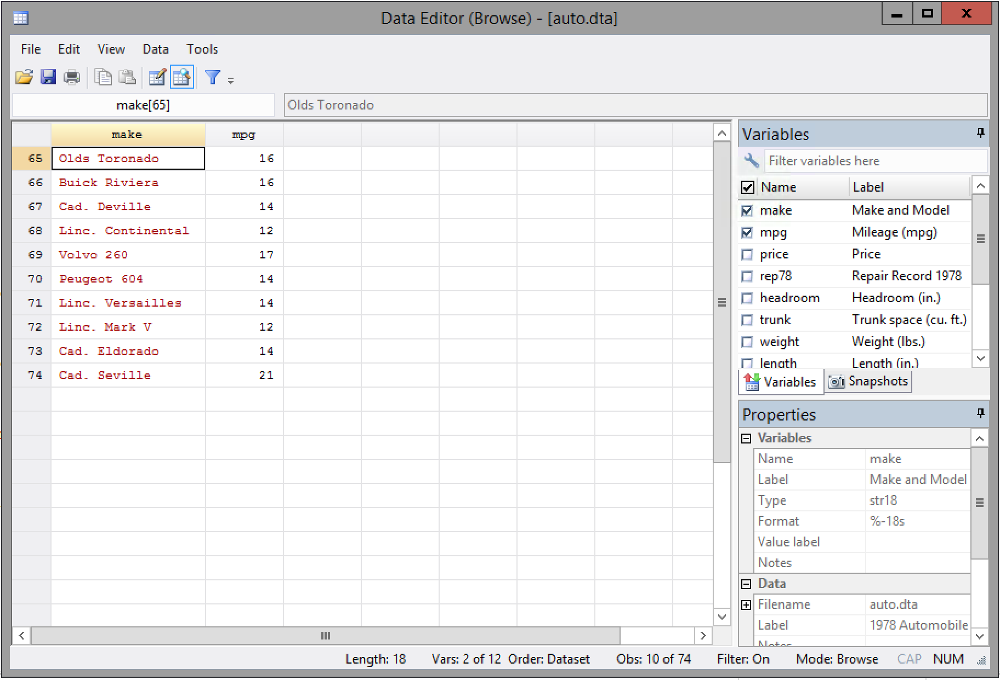
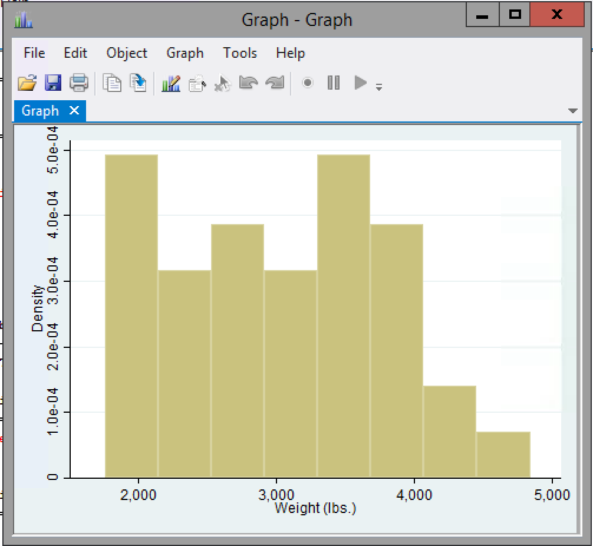
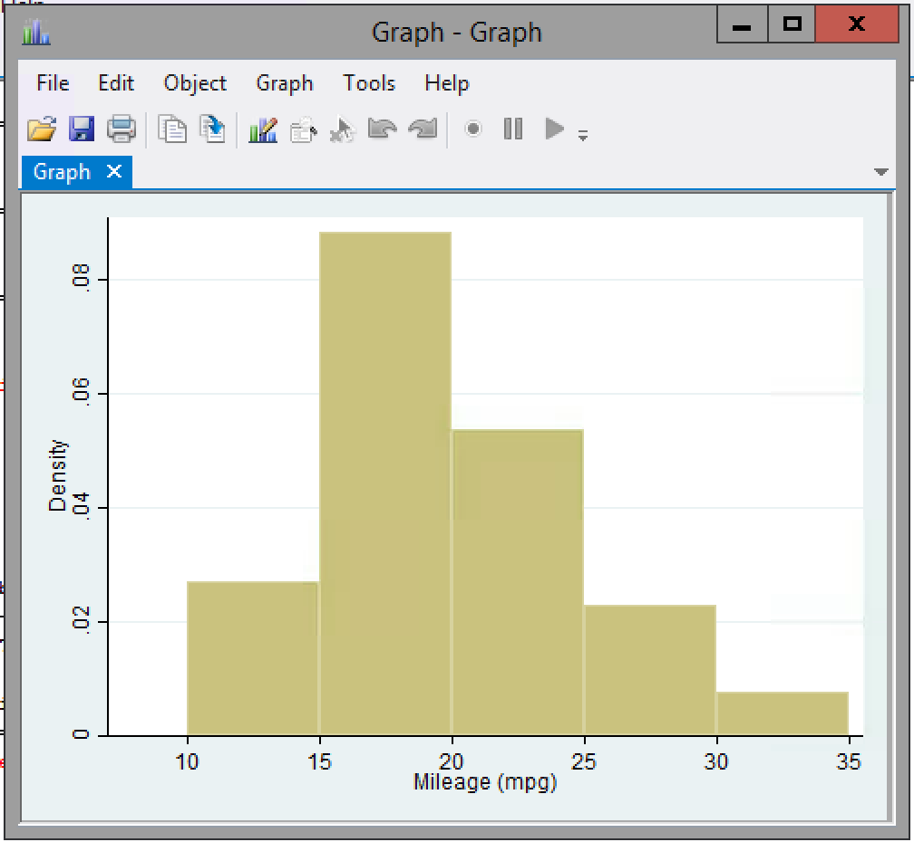
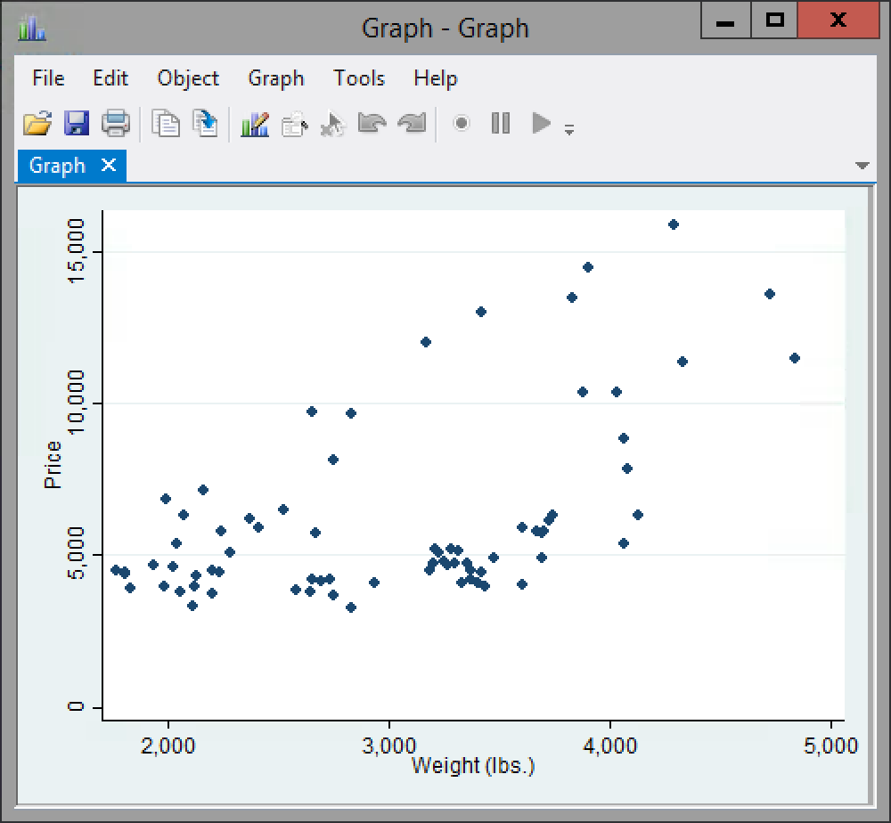

# Stata - Applied Economics

## About this introduction to Stata

This introduction provides a stripped-down overview of some of the features, and commands available within Stata, as well as helpful examples of the features in their context.

Examples within this document are given with the included dataset `auto.dta` which is a set of Consumer Reports data on US Automobiles in 1978. To replicate the examples, load the data using `sysuse auto.dta, clear` (note this will delete the data currently in your environment).

## Using a .do file

Stata supports interactive or .do file command execution. While the interactive console can be convenient for experimentation, it is really bad for creating reproducible work, and easily allows errors to enter into your results unnoticed. 

As such always make sure work is written in a `.do` file.

## Commands

### Environment setup

`cd` Sets the *working directory*, which is the default folder from which all other commands will run. This means that your output (e.g. log files) and input (e.g. data files) will all be read from and written to this location by default.

```
cd [path]
```

* `path` the full path to your desired working directory, surrounded by quotation marks if it contains spaces.

e.g.

```
cd "O:\Documents\Applied Economics\Introduction"
```

___

`use` Loads a dataset from your working directory. 

```
use [datafile] *, clear*
```

* `datafile` Filename of dataset within working directory, or relative path to working directory.
* `, clear` (**Optional**) Allows data currently stored in variables to be overwritten

e.g. 
```Stata
. use DataUoBSet2.dta, clear
```

### Data management

`display` Basic way of outputting data or the output of a calculation to the console. When presented with a list of data, the display option will output the first item

```
display [operation]
```

* `operation` A stata expression to output

e.g. Simple example

```Stata
. display 1 + 1
2
```

Concatinating Variables, Strings, and Integers. Note that despite there being 74 values for make and price only the first one is chosen

```Stata
. display make " $" price
AMC Concord $4099
```

Displaying function output

```
. display sqrt(weight)
54.129474
```

---

`list` Outputs each value for a given variable(s) or the whole dataset into the console. By default this is in a paginated form with [--More--](https://en.wikipedia.org/wiki/More_(command)), which can then be scrolled through by using any key on the keyboard. 

```
list *[variables...]*
```
* `variables...` (**Optional**) a space delimited list of variables to list

e.g. Listing the makes and prices of cars

```
. list make price

     +----------------------------+
     | make                 price |
     |----------------------------|
  1. | AMC Concord          4,099 |
  2. | AMC Pacer            4,749 |
  3. | AMC Spirit           3,799 |
  4. | Buick Century        4,816 |
  5. | Buick Electra        7,827 |
     |----------------------------|
  6. | Buick LeSabre        5,788 |
...
 27. | Linc. Mark V        13,594 |
--more--
```

When using this with a `.do` file having the interactive --more-- element is undesirable, so it is recommended to run with `set more off` environment configuration, where the same command would then be

```
. set more off

. list make price

     +----------------------------+
     | make                 price |
     |----------------------------|
  1. | AMC Concord          4,099 |
  2. | AMC Pacer            4,749 |
  3. | AMC Spirit           3,799 |
  4. | Buick Century        4,816 |
  5. | Buick Electra        7,827 |
     |----------------------------|
  6. | Buick LeSabre        5,788 |
...

 73. | VW Scirocco          6,850 |
 74. | Volvo 260           11,995 |
     +----------------------------+
```

---

`generate` `gen` creates new variables, either with an absolute value, or as the output of other variables and functions.

```
gen [name] = [operation]
```

* `name` is the name you wish to give the newly created variable. It must not already exist.
* `operation` is the operation you wish to perform to generate the new variable

e.g. To create a co-efficient of boxiness (or possibly width) for each car 

```
. gen boxiness = length * headroom / displacement
```

---

`drop` removes variables and values from the working environment. 

```
drop [variable] 
drop if [condition]
drop _all
```

* `variable` the name of the variable to drop.
* `condition` a condition upon which to drop the data. This will remove a cross-section of data across variables.
* `_all` can be used to drop all data in the environment. Useful for guaranteeing clean workspace when using .do files.

e.g. to remove all the foreign cars from the dataset

```Stata
. drop if foreign
(22 observations deleted)
```

Given that foreign is a byte variable, this is a shortcut for saying `drop if foreign == 1`.

Similarly if we don't care about the turning circle in any of our calculations we can remove the data from the set by executing

```
. drop turn
```

--- 

`replace` allows values to be set for pre-existing variables. Be wary when using this as it will change the original variables irrevocably. Because of this risk it outputs changes that have been made, so that they are not missed.

```
replace [variable] = [value] *in [index]* *if [condition]*
```

* `variable` which is to be updated with a new value
* `value` to be assigned to the variable
* `index` (**Optional**) the index (or row) of the value to replace
* `condition` (**Optional**) under which the variable will be replaced

e.g. to create a dummy variable for heavy cars we would generate the variable first, then replace the blanks

```
. gen heavy = 1 if weight > 4000
(65 missing values generated)

. replace heavy = 0 if missing(heavy)
(65 real changes made)
```

or if we know that the price is incorrect for the first car we could

```
. replace price = 30000 in 1
(1 real change made)
```

---

`describe` will provide information about a given variable, or the dataset as a whole. This will include the data type, any labels and the [display format](http://www.stata.com/help.cgi?format), together with other information about the dataset.

```
describe *[variables...]*
```

* `variables...` (**Optional**) space separated list of variables to describe

e.g. to describe the mpg and foreign variables

```
. describe mpg foreign

              storage   display    value
variable name   type    format     label      variable label
---------------------------------------------------------------------
mpg             int     %8.0g                 Mileage (mpg)
foreign         byte    %8.0g      origin     Car type
```

or to get information on the whole dataset

```
. describe

Contains data from C:\Program Files\Stata14IC\ado\base/a/auto.dta
  obs:            74                          1978 Automobile Data
 vars:            12                          13 Apr 2014 17:45
 size:         3,182                          (_dta has notes)
---------------------------------------------------------------------
              storage   display    value
variable name   type    format     label      variable label
---------------------------------------------------------------------
make            str18   %-18s                 Make and Model
price           int     %8.0gc                Price
mpg             int     %8.0g                 Mileage (mpg)
rep78           int     %8.0g                 Repair Record 1978
headroom        float   %6.1f                 Headroom (in.)
trunk           int     %8.0g                 Trunk space (cu. ft.)
weight          int     %8.0gc                Weight (lbs.)
length          int     %8.0g                 Length (in.)
turn            int     %8.0g                 Turn Circle (ft.)
displacement    int     %8.0g                 Displacement (cu. in.)
gear_ratio      float   %6.2f                 Gear Ratio
foreign         byte    %8.0g      origin     Car type
---------------------------------------------------------------------
Sorted by: foreign

```

---

`rename` simply changes the name of a variable. 

```
rename [variable] [name]
```

* `variable` the current name of the variable to change
* `name` the new name to use for the variable

e.g.

```
. rename rep78 repairRecord
```

---

## Table outputs

`summarize` most often used to provide quick details of a given variable

---

`tabulate` `tab` can quickly collect variables, as well as providing pdf/cdf values for a given sample within the dataset. Also possible to use for generating dummy variables from factor variables.

```
tabulate [variable] *, generate([newVarName])*
```

* `variable` is the 

---

`tabstat` a compact output 

```
tabstat [variable...] *,* *by([variable])* *stat([statnames...])*
```

* `variable` space delimited list of variables to provide statistics for
* `by(variable)` category variable by which to divide out the values
* `statnames` space delimited list of names for stats (see [here](http://www.stata.com/help.cgi?tabstat#statname))

e.g. to show prices and fuel efficiency for domestic and foreign cars

```
. tabstat price mpg, by(foreign)

Summary statistics: mean
  by categories of: foreign (Car type)

 foreign |     price       mpg
---------+--------------------
Domestic |  6072.423  19.82692
 Foreign |  6384.682  24.77273
---------+--------------------
   Total |  6165.257   21.2973
------------------------------
```

or to look at various properties of the prices

```
. tabstat price, stat(mean sd q)

    variable |      mean        sd       p25       p50       p75
-------------+--------------------------------------------------
       price |  6165.257  2949.496      4195    5006.5      6342
----------------------------------------------------------------
```

---

`table` is both the most complex and most simple of the table outputs, providing all the functionality of the others, but with far fewer default behaviours.

## Interactive Env

`browse` opens a spreadsheet-like table of all or the selected variables in the Stata Graphical User Interface, according to any filters which may have been imposed.

```
browse *[variables...]* *if [condition]* *, nolabel*
```

* `variables` (**Optional**) space delimited list of which variables to display (all variables displayed by default)
* `condition` (**Optional**) filter condition for which values to display
* `nolabel` (**Optional**) displays values without their label being used (e.g. display foreign as 0 or 1 instead of domestic or foreign)

e.g. to browse the name and mpg of properties for cars worth more than 10,000

```
. browse make mpg if price > 10000
```



---

`edit` is like browse, however the table cells are editable. This is not a recommended way of making edits to your data, however any changes made here will show in the console as their equivlent commands.

### Graph

Graphing functions all have lots of options, however the examples given here are will provide a very brief examples for each case. See the stata docs for details on things like labeling, colouring or otherwise customizing graph functionality.

`histogram` draws a histogram to display the density or percentage change for a given value or range. *Note the comma in the following*

```
histogram [variable] *if [condition]*, *start([start])* *width([width])* *bin([no_of_bins])* *nodraw saving([filename])*
```

* `variable` is the variable data to use for the histogram
* `condition` (**Optional**) is the filter condition for the data
* `start` (**Optional**) The minimum value to display on the graph
* `width` (**Optional**) the value range for the bins (i.e. largest value - smallest value in each bin) 
* `no_of_bins` (**Optional**) the number of bins to display on the histogram
* `filename` (**Optional**) the filename to save the graph under. Useful for when using .do files.

e.g. to do a default histogram of weight

```
. histogram weight
```



to display the mpg values for domestic cars with bars each covering a range of 5

```
. histogram mpg if foreign == 0, width(5) start(10)
(bin=5, start=10, width=5)
```



---

`scatter` creates a basic scatter plot of two datasets

```
scatter [variable1] [variable2] *[w=[weight_variable]]*
```

* `variable1` is the y-axis variable
* `variable2` is the x-axis variable
* `weight_variable` variable to use in creating weighted points

e.g. to create a simple scatter plot of price and weight

```
. scatter price weight
```



To create a scatter plot of mpg and weight with markers weighted based on the price

```
. scatter mpg weight [w=price], msymbol(circle_hollow)
(analytic weights assumed)
(analytic weights assumed)
(analytic weights assumed)
```

![scatter mpg weight [w=price], msymbol(circle_hollow)](WeightedScatter.png)

---

`twoway` is the generic form for a two way plot (e.g. scatter, line etc.) and provides the ability to plot multiple lines on the same axis.

---

`graph` As with table the `graph` functionality is the generic form for graphs and can be used to create any graph, and some graphing forms require this. See [Stata Documentation](http://www.stata.com/help.cgi?graph) for full details.

### Execute

`regress` `reg`

`predict`

### Test

`test`

`ttest`

### Survivor Model

`stset`

`streg`

`sts`

## Useful features

## Maths Macros

`+` `-` `/` `*` `^` Operators

`log` `ln`

`exp`

`sqrt`

`sum`

`min` `max`

`floor` `ceiling` `round`

`int`

### Factor Variables

http://www.stata.com/help.cgi?fvvarlist

`xi`

### Special Variables

`egen`

`local`

`return` `r`

`ereturn` 

### log

`capture`

`using`

### Flow control

`while`

`for`

### Labelling

Labelling could have fallen under the main category, however it turns out that it is incredibly powerful within Stata. With support for [i18n](https://en.wikipedia.org/wiki/Internationalization_and_localization), labelling data sets, variables and data values, it cannot easily be covered in the same short-format as other commands. `label` applies and manages labels for datasets, variables, and data values.

For a great guide to this see the [Princeton Stata Tutorial Section 2.3](http://data.princeton.edu/stata/DataManagement.html#s23)
